# Instacart Databricks Lakehouse Analytics

An end-to-end retail analytics project built with Databricks Free Edition, PySpark, Spark SQL, Delta tables, Unity Catalog, medallion architecture, automated data-quality checks, customer segmentation, and an AI/BI dashboard.

## Project Overview

This project demonstrates how raw Instacart order data can be transformed into reliable, analysis-ready datasets using a lakehouse architecture.

The pipeline ingests CSV files into Databricks, processes them through Bronze, Silver, and Gold layers, validates the resulting datasets with automated quality checks, and creates dashboard-ready tables for business reporting.

The final dashboard provides insights into:

* overall order and customer activity
* product and department performance
* reorder behaviour
* shopping patterns by weekday and hour
* rule-based customer segments

## Business Objectives

The project was designed to answer the following questions:

1. Which products and departments generate the highest purchase volume?
2. Which products demonstrate strong reorder behaviour?
3. When do customers place the most orders?
4. How does shopping activity vary by day of week and hour of day?
5. What customer behavioural segments can be identified?
6. How can data quality be validated before reporting?

## Architecture

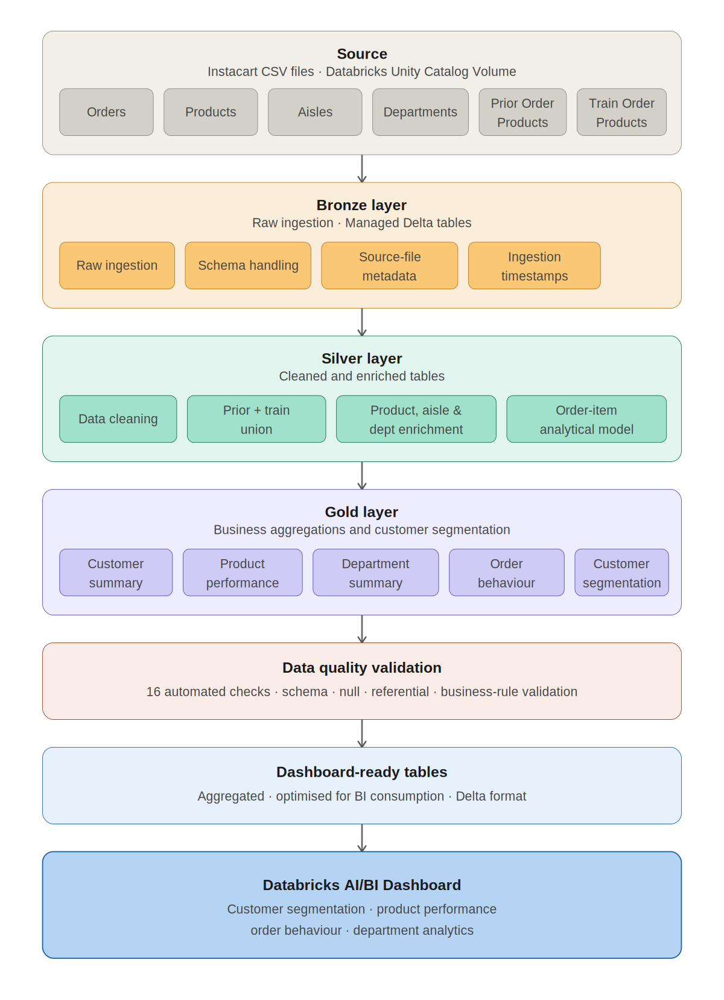

The pipeline follows this flow:

```text
Instacart CSV Files
        ↓
Databricks Unity Catalog Volume
        ↓
Bronze Delta Tables
        ↓
Silver Cleaned and Enriched Tables
        ↓
Gold Business Aggregations
        ↓
Automated Data-Quality Validation
        ↓
Dashboard-Ready Tables
        ↓
Databricks AI/BI Dashboard
```

## Technology Stack

* Databricks Free Edition
* Apache Spark
* PySpark
* Spark SQL
* Delta Lake
* Unity Catalog
* Databricks Volumes
* Databricks AI/BI Dashboards
* Python
* GitHub

## Dataset

The project uses data from the Instacart Market Basket Analysis dataset.

The source data includes:

* orders
* products
* aisles
* departments
* prior order-product transactions
* train order-product transactions

A project-sized sample was prepared so the pipeline could run efficiently within Databricks Free Edition.

Raw and sampled CSV files are not stored in this repository. Additional dataset and sampling details are available in:

* [`data/README_DATA.md`](data/README_DATA.md)
* [`data/sampling_manifest.json`](data/sampling_manifest.json)

## Medallion Architecture

### Bronze Layer

The Bronze layer preserves the source data with minimal transformation.

Key activities include:

* CSV ingestion from a Unity Catalog Volume
* schema inference and schema handling
* correction of quoted product-name parsing
* source-file metadata
* ingestion timestamps
* storage as managed Delta tables

Bronze tables:

* `bronze_orders`
* `bronze_order_products_prior`
* `bronze_order_products_train`
* `bronze_products`
* `bronze_aisles`
* `bronze_departments`

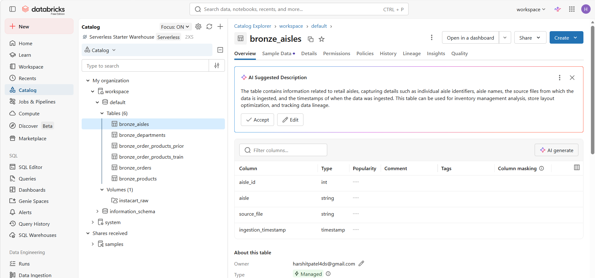

### Silver Layer

The Silver layer cleans, standardizes, combines, and enriches the raw datasets.

Key transformations include:

* combining prior and train transaction records
* removing duplicate and invalid records
* joining products with aisle and department attributes
* enriching transactions with customer and order information
* creating a central order-item analytical table

Silver tables:

* `silver_orders`
* `silver_product_dimension`
* `silver_order_items`

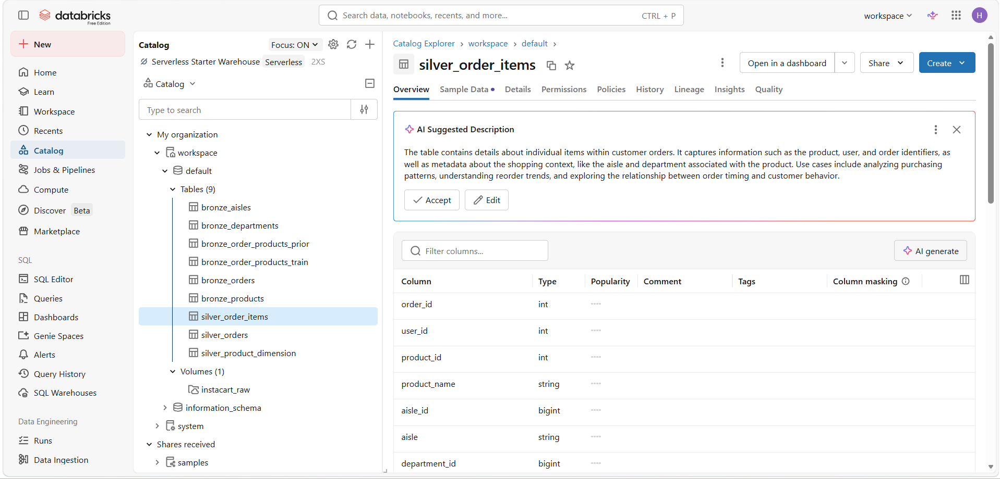

#### Enriched Order-Item Model

The central Silver table combines order, customer, product, aisle, department, cart-position, reorder, and order-timing attributes.

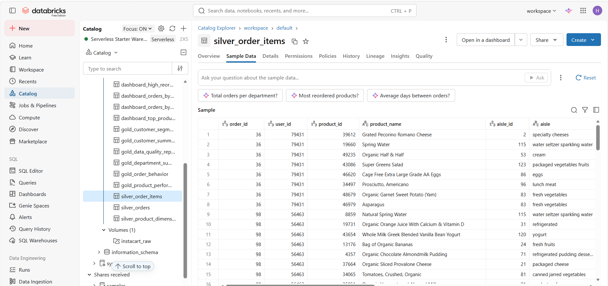

### Gold Layer

The Gold layer provides business-ready aggregated tables for reporting and analysis.

Gold tables include:

* `gold_customer_summary`
* `gold_product_performance`
* `gold_department_summary`
* `gold_order_behavior`
* `gold_customer_segmented`
* `gold_data_quality_report`

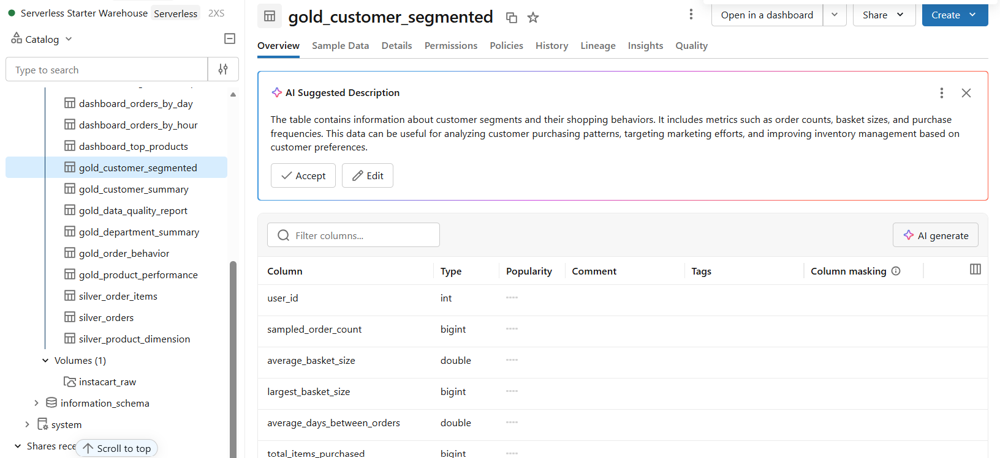

#### Customer Summary

The customer-level model includes metrics such as:

* sampled order count
* total items purchased
* unique products purchased
* average basket size
* largest basket size
* average reorder rate
* average days between orders
* favourite department

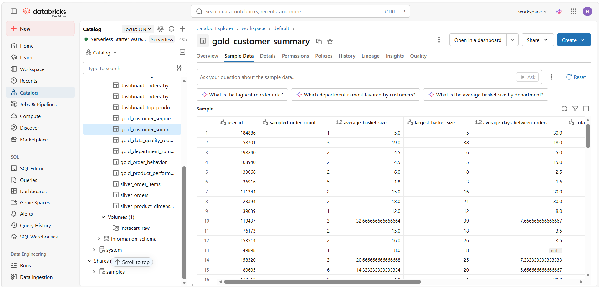

## Data-Quality Framework

The project includes 16 automated checks covering:

* duplicate identifiers
* missing required values
* invalid business ranges
* invalid reorder values
* invalid weekday and hour values
* negative days since prior order
* invalid cart positions
* referential integrity
* invalid customer reorder rates
* invalid product reorder rates
* invalid basket-size metrics

The `severity` column indicates the importance of a rule if it fails, while the `status` column records the actual result.

All 16 checks completed successfully with:

* `status = PASS`
* `failed_rows = 0`

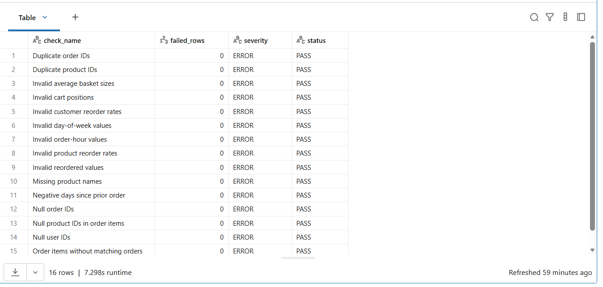

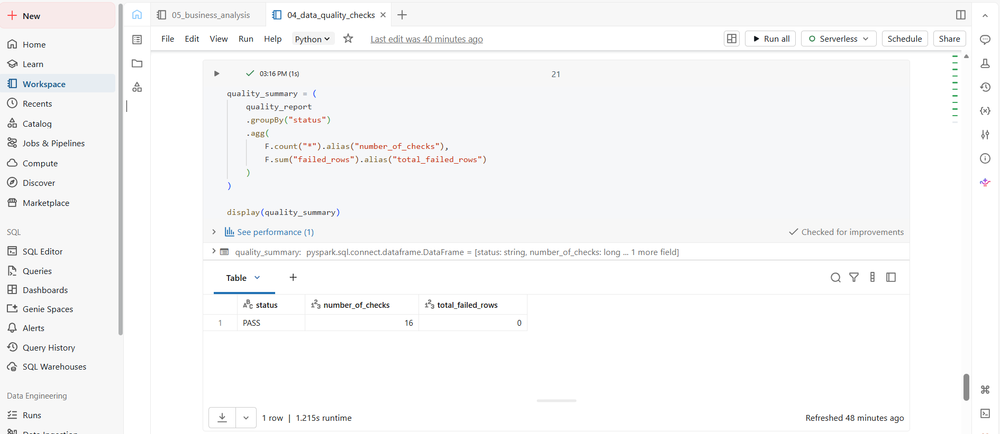

## Customer Segmentation

Customers were assigned to interpretable behavioural segments using sampled order frequency, basket size, and reorder rate.

Segments include:

* Loyal High-Frequency
* Large Basket
* Repeat Buyer
* Low Activity
* Regular Customer

These are descriptive, rule-based segments intended for business analysis rather than predictive modelling.

## Dashboard

The Databricks AI/BI dashboard summarizes executive metrics and business patterns.

### Executive KPIs

* Total orders: **109,467**
* Total customers: **54,726**
* Unique products: **36,117**
* Overall reorder rate: **62.4%**

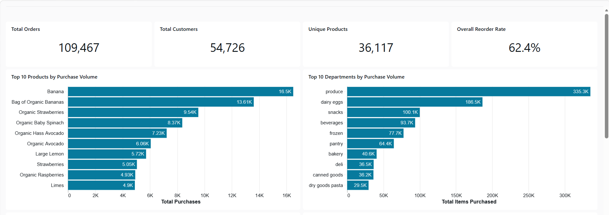

### Product and Department Insights

The dashboard highlights:

* top products by purchase volume
* top departments by total items purchased
* customer demand concentration across product categories

Produce generated the largest purchase volume among departments, while bananas and organic bananas were among the most frequently purchased products.

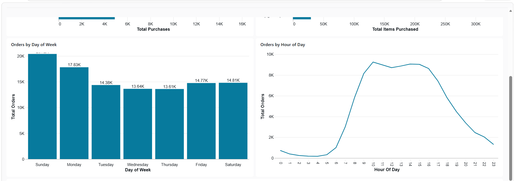

### Ordering Patterns and Customer Segments

The dashboard also analyses:

* orders by day of week
* orders by hour of day
* customer segment distribution

Sunday recorded the highest order volume in the sampled data. Ordering activity was concentrated from the morning through the afternoon, with substantially lower activity during overnight hours.

The Repeat Buyer segment represented the largest customer group.

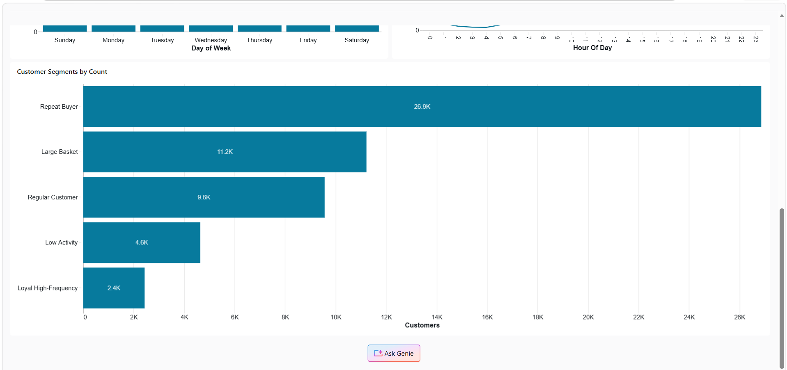

The complete dashboard export is available here:

[View the dashboard PDF](dashboard/instacart_lakehouse_analytics_dashboard.pdf)

## Key Business Insights

1. **Reordering is a major component of customer activity.**
   The overall reorder rate was 62.4%, indicating that repeat purchases account for a substantial portion of the sampled transactions.

2. **Fresh-food categories dominate demand.**
   Produce generated the highest department-level purchase volume, followed by dairy and eggs.

3. **A small number of staple products lead purchase volume.**
   Bananas, organic bananas, strawberries, spinach, and avocados ranked among the most frequently purchased products.

4. **Order demand varies by day and hour.**
   Sunday recorded the highest order volume, while demand increased sharply during the morning and remained elevated through the afternoon.

5. **Repeat-oriented customers form the largest segment.**
   The Repeat Buyer segment was considerably larger than the other behavioural groups.

## Repository Structure

```text
instacart-databricks-lakehouse/
├── notebooks/
│   ├── 01_bronze_ingestion.ipynb
│   ├── 02_silver_cleaning_and_model.ipynb
│   ├── 03_gold_business_tables.ipynb
│   ├── 04_data_quality_checks.ipynb
│   └── 05_business_analysis.ipynb
├── images/
│   ├── 01_bronze_tables_catalog.png
│   ├── 02_silver_tables_catalog.png
│   ├── 03_silver_order_items_preview.png
│   ├── 04_gold_tables_catalog.png
│   ├── 05_gold_customer_summary_preview.png
│   ├── 06_data_quality_report.png
│   ├── 07_data_quality_summary.png
│   ├── 08_dashboard_upper_section.png
│   ├── 09_dashboard_middle_section.png
│   └── 10_dashboard_lower_section.png
├── docs/
│   └── instacart_lakehouse_architecture.png
├── dashboard/
│   └── instacart_lakehouse_analytics_dashboard.pdf
├── data/
│   ├── README_DATA.md
│   └── sampling_manifest.json
├── .gitignore
├── LICENSE
└── README.md
```

## Notebook Execution Order

Run the notebooks in the following sequence:

1. `01_bronze_ingestion.ipynb`
2. `02_silver_cleaning_and_model.ipynb`
3. `03_gold_business_tables.ipynb`
4. `04_data_quality_checks.ipynb`
5. `05_business_analysis.ipynb`

## How to Run the Project

1. Create a Databricks workspace with Unity Catalog access.
2. Create a Volume for the Instacart CSV files.
3. Upload the prepared source files to the Volume.
4. Update the source path in the Bronze notebook if required.
5. Run the notebooks in the documented execution order.
6. Confirm that the Bronze, Silver, Gold, and dashboard-ready Delta tables are created.
7. Review the data-quality report before using the analytical outputs.
8. Build or refresh the Databricks AI/BI dashboard using the dashboard-ready tables.

## Limitations

* The project uses a sample of the original Instacart dataset.
* Customer metrics represent sampled behaviour rather than complete customer lifetime activity.
* Rule-based segments are descriptive and depend on manually selected thresholds.
* The dataset does not include product price, revenue, promotion, or profitability information.
* The pipeline uses full-refresh overwrite logic for portfolio development rather than incremental production ingestion.

## Future Enhancements

Potential future improvements include:

* incremental ingestion using Auto Loader
* workflow orchestration with Databricks Jobs
* Delta Live Tables or Lakeflow declarative pipelines
* parameterized notebook execution
* advanced data-quality expectations
* machine-learning customer segmentation
* market-basket analysis
* product recommendation modelling
* Power BI integration
* Microsoft Fabric implementation
* CI/CD and automated testing

## Related Articles

- [From Experience to Understanding: What Two Databricks Learning Tracks Taught Me About the Modern Data Lifecycle](https://medium.com/@harshitpatel4ds/from-experience-to-understanding-what-two-databricks-learning-tracks-taught-me-about-the-modern-ac005a8beebe)

- [Building an End-to-End Lakehouse on Databricks: Instacart Analytics from Pipeline to Insight](https://medium.com/@harshitpatel4ds/building-an-end-to-end-lakehouse-on-databricks-instacart-analytics-from-pipeline-to-insight-a88483aa3895)
  
## Author

**Harshit Patel**

Data Analytics | Business Intelligence | Data Engineering

## License

This project is licensed under the MIT License.
